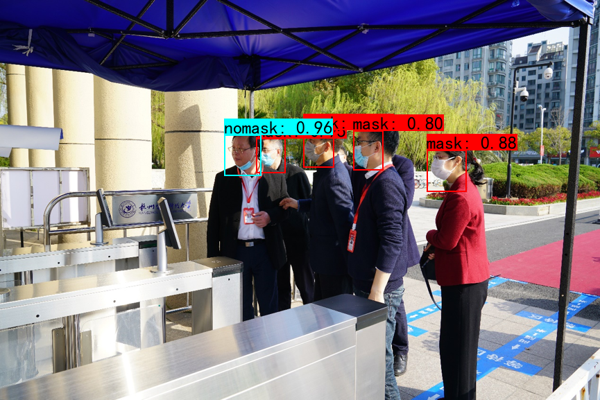
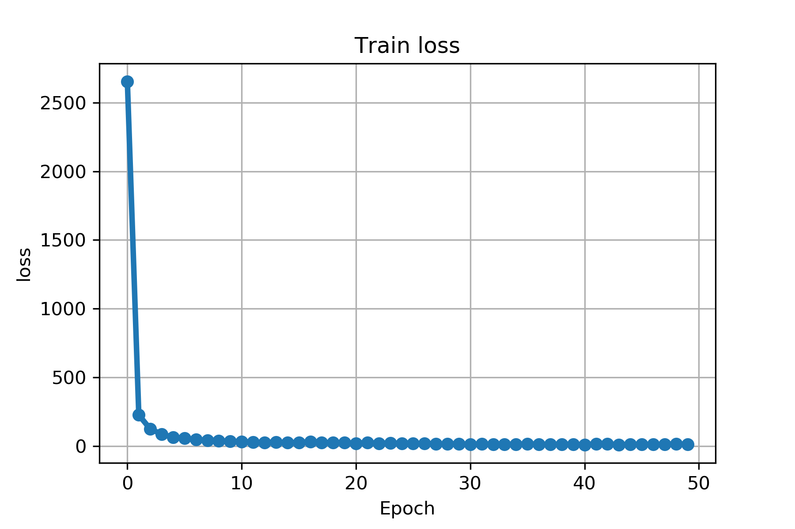
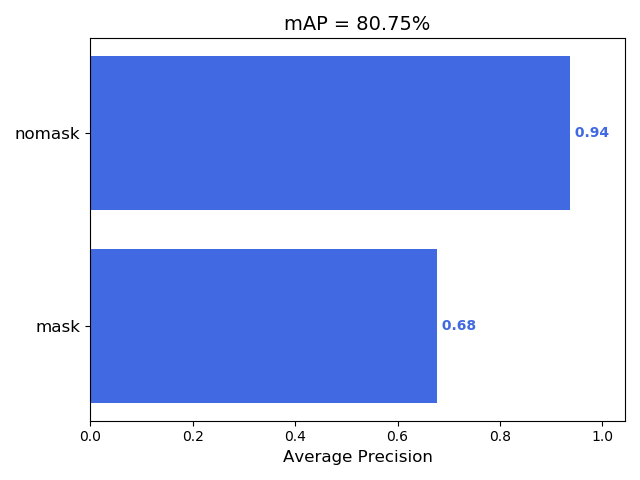

# 基于PyTorch&YOLOv4的口罩佩戴检测

本项目是利用YOLOv4进行口罩佩戴检测，使用PyTorch实现。虽然现在国内疫情基本得到有效遏制，但防控仍不可过于松懈，在一些公共场合佩戴口罩还是必不可少的。基于此，自己做了该项目，后续打算继续改进，争取将其运行到边缘设备上。希望本项目能给疫情常态化防控出一份力，也希望真正的新年早日到来。

数据集一部分来源于参考部分，另一部分为自己手动收集与标注，共1200张训练集，600张口罩佩戴，600张未佩戴口罩；400张测试集，200张口罩佩戴，200张未佩戴口罩。利用YOLOv4在数据集上冻结backbone训练了25个epoch，解冻后再训练了25个epoch，测试mAP为80.75%。检测效果如下：

在NVIDIA GeForce RTX 2080 Ti上FPS大概能达到13左右。

## 目录
- [基于PyTorch&YOLOv4的口罩佩戴检测](#基于pytorchyolov4的口罩佩戴检测)
  - [目录](#目录)
  - [安装](#安装)
    - [数据集](#数据集)
    - [依赖库](#依赖库)
    - [模型权重](#模型权重)
  - [使用](#使用)
    - [检测图片](#检测图片)
    - [检测视频](#检测视频)
    - [训练](#训练)
    - [评估](#评估)
  - [其他](#其他)
    - [目前进展](#目前进展)
    - [训练&评估结果](#训练评估结果)
  - [参考](#参考)
  - [License](#license)

## 安装
### 数据集
[链接](https://pan.baidu.com/s/12lynrRjSlNkkWeB3lKAlMw)  提取码：cgp1
### 依赖库
- Python >= 3.7
- PyTorch >= 1.4.0
- opencv-python >= 4.2.0.32
- Pillow >= 7.0.0
### 模型权重
  -  COCO数据集预训练模型：[链接](https://pan.baidu.com/s/1JDclXgxDmA06Mv6hrRB5Sw)  提取码：cp4g
  - 本项目训练权重：[链接](https://pan.baidu.com/s/1opAbsydKnS1WWN9rgaH5IA)  提取码：kk47

## 使用
### 检测图片
使用Jupyter Notebook打开predict.ipynb，设置好图片路径后，运行detect_image()函数即可。

### 检测视频
使用Jupyter Notebook打开predict.ipynb，设置好视频路径后，运行detect_video()函数即可。

### 训练
下载预训练模型：
- COCO数据集预训练模型：[链接](https://pan.baidu.com/s/1JDclXgxDmA06Mv6hrRB5Sw)  提取码：cp4g
- 本项目训练权重：[链接](https://pan.baidu.com/s/1opAbsydKnS1WWN9rgaH5IA)  提取码：kk47

使用Jupyter Notebook打开train.ipynb，设置好数据路径、模型路径以及超参数后，即可进行训练。

### 评估
使用Jupyter Notebook打开eval.ipynb，设置好测试集路径后，运行即可生成detection-results和ground-truth。

再运行mAP目录下的main.py，即可计算mAP等结果。
  
## 其他
### 目前进展
- [x] CSPDarknet53
- [x] SPP、PAN
- [x] Mosaic数据增强
- [x] Label Smoothing
- [x] CIOU
- [x] 学习率余弦变化
- [x] Mish激活函数
### 训练&评估结果

## 参考
- 部分数据集来源：
  - https://github.com/hikariming/virus-mask-dataset
  - https://www.kesci.com/home/dataset/5e958c69e7ec38002d033362
- YOLOv4 PyTorch基于：https://github.com/bubbliiiing/yolov4-pytorch
- mAP计算：https://github.com/Cartucho/mAP

## License
[GPL](https://github.com/Bil369/MaskDetect-YOLOv4-PyTorch/blob/master/LICENSE) &copy; [Bil369](https://github.com/Bil369)
